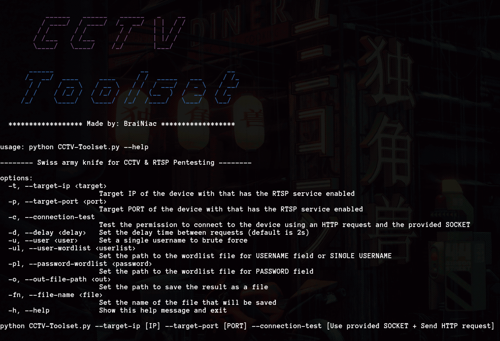

# CCTV Toolset

A versatile toolkit for CCTV and RTSP pentesting, designed with modularity and ease of use in mind.

---





## ✨ Features

-   **RTSP Connection Testing:** Verify connectivity to RTSP servers with detailed response analysis.
-   **Authentication test module (Brute-Force):** Test robustness of your secure authentication mechanism that is integrated with RTSP protocol using customizable wordlists.
-   **Clean Architecture:**  Built with a modular design, maintainable, scalable.
-   **Dependency Management:** Automated dependencies installation on first run.
-   **Detailed Output:** Saves successful Auth tests results to a file for later review.
-   **User-Friendly Interface:**  Command-line interface (CLI) with clear help messages and argument handling.

---

## ⚙️ Installation

1.  **Clone the repository:**

```bash
  git clone https://github.com/babyboydaprince/cctv-toolset.git
  cd cctv-toolset
```

2.  **Run the Tool:**

```bash
  python app/CCTV-Toolset.py
```

    > **Note:** On the first run, the tool will automatically;<br> 
    > install any missing dependencies;<br>
    > The **flag file (`.installed`)** ensures dependencies are installed only once per environment;

---

## 🚀 Usage

### 🧪 RTSP Connection Test

This option tests the connectivity to the specified RTSP server 
and displays the server's response.

```bash
  python app/CCTV-Toolset.py -t <target-ip> -p <target-port> --connection-test
```

-   **`<target-ip>`:** The IP address of the RTSP server.
-   **`<target-port>`:** The port number of the RTSP server (typically 554 or 8554).

**Example:**

```bash
  python app/CCTV-Toolset.py -t 192.168.1.100 -p 554 --connection-test
```

### 🔑 RTSP authentication tester

This option performs various attempts onto the specified RTSP server, 
attempting to find valid credentials combinations, just so it's possible to guarantee
that the secure authentication method/logic is robust and does not leak data or credentials.

```bash
  python app/CCTV-Toolset.py -t <target-ip> -p <target-port> -u <username> -pl <password-wordlist> -o <output-path> -fn <output-filename>
```

or

```bash
  python app/CCTV-Toolset.py -t <target-ip> -p <target-port> -ul <user-wordlist> -pl <password-wordlist> -o <output-path> -fn <output-filename> -d <delay>
```

-   **`<target-ip>`:** The IP address of the RTSP server.
-   **`<target-port>`:** The port number of the RTSP server.
-   **`<username>`:** (Optional) A single username to try.
-   **`<user-wordlist>`:** (Optional) Path to a wordlist file containing usernames.
-   **`<password-wordlist>`:** Path to a wordlist file containing passwords.
-   **`<output-path>`:** The directory where the output file will be saved.
-   **`<output-filename>`:** The name of the file to save successful credentials.
-   **`<delay>`:** (Optional) Time in seconds to wait between each attempt (Default: 2 seconds).

**Examples:**

```bash
  Brute-force with a single username
  python app/CCTV-Toolset.py -t 192.168.1.100 -p 8554 -u admin -pl passwords.txt -o /tmp -fn cctv-credentials
```

```bash
  Brute-force with a user wordlist
  python app/CCTV-Toolset.py -t 192.168.1.100 -p 554 -ul users.txt -pl passwords.txt -o /tmp -fn cctv-credentials -d 1.5
```

---

## 📌 Final Notes

-   The project structure follows a modular approach to make it more maintainable.
-   This **documentation** aims to provide clear instructions for the users.

---

**Disclaimer:** This tool is intended for educational and ethical testing purposes only. 
Use it responsibly and within legal boundaries. The developers are not responsible for 
any misuse of this tool.

